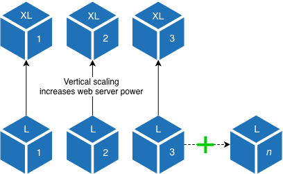

# 확장 아키텍처

클라우드 인프라는 리소스 요구 사항에 따라 확장되므로 효율성을 높일 수 있습니다. 클라우드 인프라의 Adobe Commerce은 애플리케이션을 모니터링하고 용량을 조정하여 안정적이고 예측 가능한 성능을 유지할 수 있습니다. 이 아키텍처로 전환하면 지연 또는 큰 트래픽 급증과 같은 문제를 완화하는 데 도움이 됩니다.

>[!NOTE]
>
>크기 조정된 아키텍처는 Pro 48 클러스터 이상을 사용하는 Adobe Commerce 클라우드 인프라 계정에서 사용할 수 있습니다.

## 분할 계층 아키텍처

지금까지 Pro 아키텍처는 3개의 노드로 구성되었으며, 각 노드에는 전체 기술 스택이 포함되어 있었습니다. 이제 핵심 데이터베이스 및 서비스에 대해 3개의 노드, 웹 서버에 대해 3개의 노드 등 최소 6개의 노드로 계층형 아키텍처를 제공하는 확장 가능한 인프라가 있습니다. 이 분할 계층 아키텍처는 최적의 성능 균형을 달성하기 위해 계층을 독립적으로 확장할 수 있는 기능을 제공합니다.

### 서비스 계층

데이터 스토리지, 캐시 및 서비스를 위한 세 가지 서비스 노드가 있습니다. **OpenSearch** 또는 **Elasticsearch**, **마리아DB**, **레디스**&#x200B;등. 서비스 계층이 용량에 가까워지면 CPU 성능과 메모리를 높이는 등 서버 크기를 늘리는 방법밖에 없습니다. 용량은 사용 가능한 노드 크기로 제한됩니다. 데이터베이스 클러스터는 고가용성을 제공하도록 설계되었기 때문에 사용되는 기술을 사용하여 안정적으로 수평으로 확장할 수 없습니다.


서비스 노드 인스턴스 유형이 다음과 같은 예를 살펴보겠습니다. _m5.2xlarge_ 32Gb RAM 데이터베이스와 같은 서비스는 상당한 양의 메모리(30Gb)를 사용합니다. 사용 가능한 다음 인스턴스 크기로 크기 조정 _m5.4xlarge_ 64Gb RAM을 제공하여 메모리를 두 배로 늘리고 증가하는 데이터베이스 요구 사항을 충족합니다.

노드 유형에 따라 트래픽을 라우팅하여 서비스 계층의 성능을 더욱 최적화할 수 있습니다. 기본적으로 데이터베이스 노드는 웹 트래픽에서 격리됩니다. 예를 들어 데이터베이스 노드에서 웹 트래픽을 제공하도록 선택할 수 있습니다.

### 웹 계층

요청 및 웹 트래픽을 처리하기 위한 세 가지 웹 노드가 있습니다. **php-fpm** 및 **NGINX**. 파워와 메모리를 늘려 수직적으로 확장할 수 있을 뿐만 아니라, 웹 계층은 PHP 수준에서 제한될 때 기존 클러스터에 웹 서버를 추가하여 수평적으로 확장할 수 있습니다. 다음을 참조하십시오 [자동 크기 조정](autoscaling.md) 웹 노드가 자동으로 확장되는 방법을 알아봅니다.



이는 서비스 계층에서 제공하는 세로 크기 조절을 보완합니다. 서비스 티어가 증가하는 데이터베이스와 서비스 사용량을 수용할 수 있도록 크기와 성능이 확장됨에 따라 웹 티어는 프로세스 요청의 증가와 더 높은 트래픽 요구 사항을 수용할 수 있도록 크기, 전력 및 인스턴스가 확장됩니다.

웹 노드 인스턴스 유형이 다음과 같은 예제를 생각해 보십시오. _C5.2xlarge(8개의 CPU 및 16Gb RAM 포함)_. 사이트에 대한 요청 수가 크게 증가했습니다. C5.2xlarge 노드를 추가하여 php-fpm 프로세스의 증가를 처리하거나 각 인스턴스 유형을 로 변경할 수 있습니다. _C5.4xlarge(16 CPU 및 32Gb RAM 포함)_. 노드를 추가하면 서지 용량이 부족해질 위험이 줄어듭니다.

## 프로젝트 구조

Scaled 아키텍처를 사용하는 Pro 프로젝트에는 최소 6개의 노드가 있습니다.

- 3개의 웹 노드 c5.2xlarge(8 CPU, 16Gb RAM)

- 3개의 서비스 노드 m5.2xlarge(8 CPU, 32Gb RAM)

그러나 각 프로젝트는 고유하며 리소스 관리를 제대로 분석하기 위해 성능 모니터링이 필요합니다. 각 계정에는 [New Relic 서비스](../monitor/new-relic-service.md)애플리케이션 데이터 및 성능 분석과 자동으로 연결되어 동적 서버 모니터링을 제공합니다. 특히 New Relic 서비스를 사용하여 CPU 및 RAM 사용률을 모니터링하여 추가 리소스가 필요한 노드를 확인할 수 있습니다. 리소스가 용량에 도달하거나 분석에 따라 성능이 저하되는 것을 발견하면 요청을 만들어 수요를 충족하도록 인프라를 확장할 수 있습니다.

### SSH 액세스

특정 파일 및 로그(예: `/app/<project-id>/var/log` 디렉토리는 노드 간에 공유되지 않습니다. 각 노드에는 고유한 SSH 액세스 권한이 있습니다. 를 사용할 수 없습니다. `magento-cloud` 서비스 또는 웹 노드에 로그인하기 위한 CLI이지만 [!DNL Cloud Console].

```bash
ssh <node>.<project-ID>-<environment>-<user-ID>@ssh.<region>.magento.com
```

- `node` 1 - 3 - 서비스 노드에 액세스할 주소

- `node` 4~4 _n_- 웹 노드에 액세스할 주소

>[!TIP]
>
>로그인 후 서버 ID와 역할을 확인할 수 있습니다. 서비스 노드는 _통합_ 역할 및 웹 노드는 _웹_ 역할.

에 로그인할 때의 응답 예 **서비스 노드** 다음을 포함: _통합_ 역할:

```terminal
 __  __                   _          ___ _             _
|  \/  |__ _ __ _ ___ _ _| |_ ___   / __| |___ _  _ __| |
| |\/| / _` / _` / -_) ' \  _/ _ \ | (__| / _ \ || / _` |
|_|  |_\__,_\__, \___|_||_\__\___/  \___|_\___/\_,_\__,_|
            |___/

 Welcome to Magento Cloud.

 This is server unique-server-id, role project-id:unified.

project-id@server-id:~$
```

에 로그인할 때의 응답 예 **웹 노드** 다음을 포함: _웹_ 역할:

```terminal
 __  __                   _          ___ _             _
|  \/  |__ _ __ _ ___ _ _| |_ ___   / __| |___ _  _ __| |
| |\/| / _` / _` / -_) ' \  _/ _ \ | (__| / _ \ || / _` |
|_|  |_\__,_\__, \___|_||_\__\___/  \___|_\___/\_,_\__,_|
            |___/

 Welcome to Magento Cloud.

 This is server unique-server-id, role project-id:web.

project-id@server-id:~$
```

### 로그 위치

로그 위치는 노드에 따라 약간 다릅니다. 예를 들어 다음과 같은 데이터베이스 로그 **MySQL 오류 로그**&#x200B;서비스 노드()에서 사용할 수 있습니다.`/var/log/mysql/mysql-error.log`)에 포함되지만 웹 노드에서는 사용할 수 없습니다.

각 Pro 계정에는 [New Relic 로그 서비스](../monitor/new-relic-service.md): 애플리케이션의 로그 데이터와 자동으로 연결하여 동적 로그 관리를 제공합니다. 모든 노드에서 집계된 로그 데이터는 New Relic 로그 애플리케이션에 표시되므로 단일 대시보드에서 특정 노드의 성능 문제를 해결할 수 있습니다.
