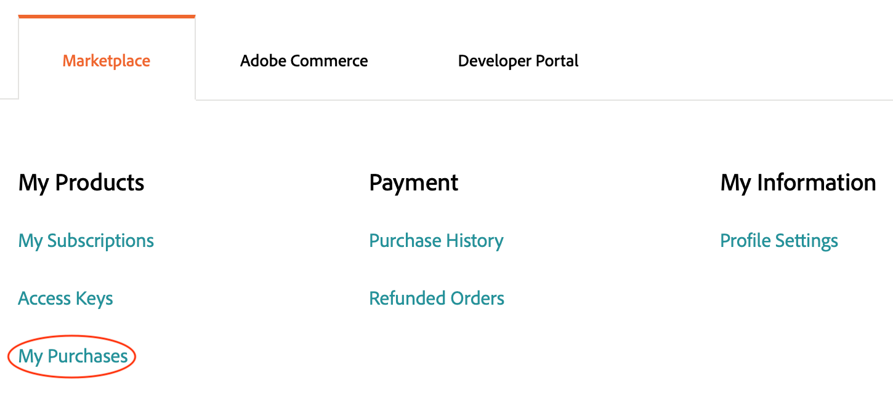

# 확장 관리

에서 확장을 추가하여 Adobe Commerce 애플리케이션 기능을 확장할 수 있습니다. [Commerce Marketplace](https://marketplace.magento.com). 예를 들어 테마를 추가하여 Storefront의 모양과 느낌을 변경하거나 언어 패키지를 추가하여 Storefront 및 관리자를 현지화할 수 있습니다.

>[!NOTE]
>
>설치 문제를 방지하려면 클라우드 프로젝트를 소유한 동일한 계정(MAGEID)을 사용하여 모든 Marketplace 구매를 완료해야 합니다.

## 확장의 작성기 이름

이 섹션에서는 Commerce Marketplace에서 확장의 작성기 이름 및 버전을 가져오는 방법에 대해 설명하지만, 의 이름 및 버전을 찾을 수 있습니다 _임의_ 모듈의 Composer 파일에 있는 모듈. 를 엽니다. `composer.json` 파일을 텍스트 편집기에 넣고 `"name"` 및 `"version"` 값.

**Commerce Marketplace에서 모듈의 Composer 이름을 가져오려면**:

1. 에 로그인 [Commerce Marketplace](https://marketplace.magento.com) (이)는 구성 요소를 구매하는 데 사용한 사용자 이름 및 암호와 함께 사용할 수 있습니다.

1. 오른쪽 상단 모서리에서 사용자 이름을 클릭하고 을(를) 선택합니다. **내 프로필**.

   

1. 다음에서 _내 계정_ 페이지, 클릭 **내 구매**.

   

1. 다음에서 _내 구매_ 페이지에서 구입한 모듈을 선택하고 **기술 세부 정보**.

1. 클릭 **복사** 복사하려면 [!UICONTROL Component name] 클립보드에 복사합니다.

1. 텍스트 편집기를 열고 구성 요소 이름을 붙여넣고 콜론 문자(`:`).

1. 위치 **기술 세부 정보**, 클릭 **복사** 복사하려면 [!UICONTROL Component version] 클립보드에 복사합니다.

1. 텍스트 편집기에서 구성 요소 이름 뒤에 버전 번호를 추가합니다. For example:

   ```text
   extension-name/magento2:1.0.1
   ```

## 확장 설치

Adobe은 구현에 확장을 추가할 때 개발 분기에서 작업할 것을 권장합니다. 확장을 설치할 때 확장 이름(`<VendorName>_<ComponentName>`)가 [`app/etc/config.php`](https://experienceleague.adobe.com/docs/commerce-operations/configuration-guide/files/deployment-files.html) 파일. 파일을 직접 편집할 필요는 없습니다.

**확장을 설치하려면**:

1. 로컬 워크스테이션에서 프로젝트 디렉터리로 변경합니다.

1. 개발 분기를 만들거나 체크 아웃합니다. 다음을 참조하십시오 [분기](../development/cli-branches.md).

1. 작성기 이름 및 버전을 사용하여 확장자를 `require` 의 섹션 `composer.json` 파일.

   ```bash
   composer require <extension-name>:<version> --no-update
   ```

1. 프로젝트 종속성을 업데이트합니다.

   ```bash
   composer update
   ```

1. 코드 변경 사항을 추가, 커밋 및 푸시합니다.

   ```bash
   git add -A
   ```

   ```bash
   git commit -m "Install <extension-name>"
   ```

   ```bash
   git push origin <branch-name>
   ```

   >[!WARNING]
   >
   >확장을 설치할 때 다음을 포함해야 합니다. `composer.lock` 원격 환경에 코드 변경 사항을 푸시할 때 파일입니다. 다음 `composer install` 명령은 `composer.lock` 원격 환경에서 정의된 종속성을 활성화하는 파일입니다.

1. 빌드 및 배포가 완료되면 SSH를 사용하여 원격 환경에 로그인하고 확장이 설치되었는지 확인합니다.

   ```bash
   bin/magento module:status <extension-name>
   ```

   확장 이름은 다음 형식을 사용합니다. `<VendorName>_<ComponentName>`.

   샘플 응답:

   ```terminal
   Module is enabled
   ```

   배포 오류가 발생하는 경우 다음을 참조하십시오 [확장 배포 실패](../deploy/recover-failed-deployment.md).

## 확장 관리

Composer를 사용하여 확장을 추가하면 배포 프로세스에서 확장을 자동으로 활성화합니다. 확장이 이미 설치되어 있는 경우 CLI를 사용하여 확장을 활성화하거나 비활성화할 수 있습니다. 확장을 관리할 때 다음 형식을 사용합니다. `<VendorName>_<ComponentName>`

원격 환경에 로그인하는 동안에는 확장을 활성화하거나 비활성화하지 마십시오.

**확장을 활성화하거나 비활성화하려면**:

1. 로컬 워크스테이션에서 프로젝트 디렉터리로 변경합니다.

1. 모듈을 활성화하거나 비활성화합니다. 다음 `module` 명령이 다음을 업데이트합니다. `config.php` 요청한 모듈 상태의 파일입니다.

   >모듈을 활성화합니다.

   ```bash
   bin/magento module:enable <module-name>
   ```

   >모듈을 비활성화합니다.

   ```bash
   bin/magento module:disable <module-name>
   ```

1. 모듈을 활성화한 경우 `ece-tools` 구성을 새로 고칩니다.

   ```bash
   ./vendor/bin/ece-tools module:refresh
   ```

1. 모듈 상태를 확인합니다.

   ```bash
   bin/magento module:status <module-name>
   ```

1. 코드 변경 사항을 추가, 커밋 및 푸시합니다.

   ```bash
   git add -A
   ```

   ```bash
   git commit -m "Disable <extension-name>"
   ```

   ```bash
   git push origin <branch-names>
   ```

## 확장 업그레이드

계속하기 전에 확장에 대한 작성기 이름과 버전이 필요합니다. 또한 확장이 프로젝트 및 Adobe Commerce 버전과 호환되는지 확인하십시오. 특히, [필요한 PHP 버전 확인](https://experienceleague.adobe.com/docs/commerce-operations/installation-guide/system-requirements.html) 시작하기 전에.

**확장을 업데이트하려면**:

1. 로컬 워크스테이션에서 프로젝트 디렉터리로 변경합니다.

1. 개발 분기를 만들거나 체크 아웃합니다. 다음을 참조하십시오 [분기](../development/cli-branches.md).

1. 를 엽니다. `composer.json` 파일을 텍스트 편집기에 넣습니다.

1. 확장을 찾아 버전을 업데이트합니다.

1. 변경 사항을 저장하고 텍스트 편집기를 종료합니다.

1. 프로젝트 종속성을 업데이트합니다.

   ```bash
   composer update
   ```

1. 코드 변경 사항을 추가, 커밋 및 푸시합니다.

   ```bash
   git add -A
   ```

   ```bash
   git commit -m "Update <extension-name>"
   ```

   ```bash
   git push origin <branch-names>
   ```

오류가 발생하면 다음을 참조하십시오. [구성 요소 장애 복구](../deploy/recover-failed-deployment.md). Adobe Commerce에서 확장을 사용하는 방법에 대한 자세한 내용은 [확장](https://experienceleague.adobe.com/docs/commerce-admin/start/resources/extensions.html) 다음에서 _관리 안내서_.
