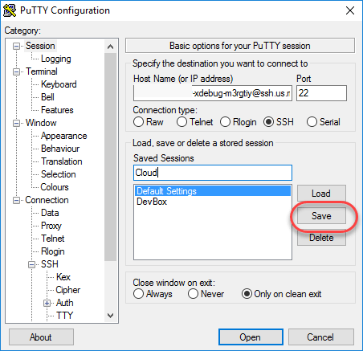

# Xdebug 구성

[!DNL Xdebug] 는 PHP를 디버깅하기 위한 확장입니다. 선택한 IDE를 사용할 수 있지만, 다음은 를 구성하는 방법을 설명합니다 [!DNL Xdebug] 및 [!DNL PhpStorm] 로컬 환경에서 디버깅할 수 있습니다.

>[!NOTE]
>
>다음을 구성할 수 있습니다. [!DNL Xdebug] Adobe Commerce on cloud infrastructure 프로젝트 구성을 변경하지 않고 로컬 디버깅을 위해 Cloud Docker 환경에서 를 실행합니다. 다음을 참조하십시오 [Docker용 Xdebug 구성](https://developer.adobe.com/commerce/cloud-tools/docker/test/configure-xdebug/).

활성화하려면 [!DNL Xdebug], Git 저장소에서 파일을 구성하고, IDE를 구성하고, 포트 전달을 설정해야 합니다. 에서 일부 설정을 구성할 수 있습니다. `magento.app.yaml` 파일. 편집 후 모든 스타터 환경 및 Pro 통합 환경에 Git 변경 사항을 푸시하여 활성화하십시오 [!DNL Xdebug]. [!DNL Xdebug] 는 이미 Pro Staging 및 프로덕션 환경에서 사용할 수 있습니다.

구성하고 나면 CLI 명령, 웹 요청 및 코드를 디버깅할 수 있습니다. 모든 클라우드 인프라 환경은 읽기 전용입니다. 코드를 로컬 개발 환경에 복제하여 디버깅을 수행합니다. Pro 스테이징 및 프로덕션 환경의 경우 다음을 참조하십시오. [추가 지침](#debug-for-pro-staging-and-production) 대상 [!DNL Xdebug].

## 요구 사항

실행 및 사용 [!DNL Xdebug]를 사용하려면 환경에 대한 SSH URL이 필요합니다. 다음을 통해 정보를 찾을 수 있습니다. [[!DNL Cloud Console]](../project/overview.md) 또는 [!DNL Cloud Onboarding UI].

## Xdebug 구성

구성하려면 [!DNL Xdebug], 다음 단계를 수행합니다.

- [분기에서 작업하여 파일 업데이트 푸시](#get-started-with-a-branch)
- [사용 [!DNL Xdebug] 환경용](#enable-xdebug-in-your-environment)
- [IDE 구성](#configure-phpstorm)
- [포트 전달 설정](#set-up-port-forwarding)

### 분기 시작

추가하려면 [!DNL Xdebug], Adobe은에서 작업할 것을 권장합니다. [개발 분기](../dev-tools/cloud-cli-overview.md#create-an-environment-branch).

### 환경에서 Xdebug 활성화

다음을 활성화할 수 있습니다. [!DNL Xdebug] 모든 Starter 환경 및 Pro 통합 환경에 직접 연결 이 구성 단계는 Pro 프로덕션 및 스테이징 환경에는 필요하지 않습니다. 다음을 참조하십시오 [Pro Staging 및 프로덕션에 대한 디버그](#debug-for-pro-staging-and-production).

활성화하려면 [!DNL Xdebug] 프로젝트에 대해 을(를) 추가합니다 `xdebug` (으)로 `runtime:extensions` 의 섹션 `.magento.app.yaml` 파일.

**Xdebug를 활성화하려면**:

1. 로컬 터미널에서 `.magento.app.yaml` 파일을 텍스트 편집기에 넣습니다.

1. 다음에서 `runtime` 섹션, 아래 `extensions`, 추가 `xdebug`. For example:

   ```yaml
   runtime:
       extensions:
           - redis
           - xsl
           - newrelic
           - sodium
           - xdebug
   ```

1. 변경 내용을 `.magento.app.yaml` 파일을 만들고 텍스트 편집기를 종료합니다.

1. 변경 사항을 추가, 커밋 및 푸시하여 환경을 재배포합니다.

   ```bash
   git add -A
   ```

   ```bash
   git commit -m "Add xdebug"
   ```

   ```bash
   git push origin <environment-ID>
   ```

Starter 환경 및 Pro 통합 환경에 구축 시 [!DNL Xdebug] 을(를) 이제 사용할 수 있습니다. IDE 구성을 계속합니다. PhpStorm의 경우 [PhpStorm 구성](#configure-phpstorm).

### PhpStorm 구성

다음 [PhpStorm](https://www.jetbrains.com/phpstorm/) IDE가 올바르게 작동하도록 구성해야 함 [!DNL Xdebug].

**Xdebug에서 작동하도록 PhpStorm을 구성하려면**:

1. PhpStorm 프로젝트에서 **설정** 패널.

   - _macOS_- 선택 **PhpStorm** > **환경 설정**.
   - _Windows/Linux_- 선택 **파일** > **설정**.

1. 다음에서 _설정_ 패널, 확장 및 찾기 **언어 및 프레임워크** > **PHP** > **서버** 섹션.

1. 다음을 클릭합니다. **+** 서버 구성을 추가합니다. 프로젝트 이름이 맨 위에 회색으로 표시됩니다.

1. [선택 사항] 새 서버 구성에 대해 다음 설정을 구성합니다. 다음을 참조하십시오 [구성된 디버그 서버 없음](https://www.jetbrains.com/help/phpstorm/troubleshooting-php-debugging.html#no-debug-server-is-configured) 다음에서 _PHPStorm_ 설명서를 참조하십시오.

   - **이름**—호스트 이름과 동일하게 입력합니다. 이 값은 의 값과 일치해야 합니다. `PHP_IDE_CONFIG` 의 변수 [CLI 명령 디버그](#debug-cli-commands) 를 사용하여 디버깅을 수행합니다.
   - **호스트**—호스트 이름을 입력합니다.
   - **포트**- Enter `443`.
   - **디버거**- 선택 `Xdebug`.

1. 선택 **경로 매핑 사용**. 다음에서 _파일/디렉터리_ 창, 프로젝트의 루트 `serverName` 표시됩니다.

1. 다음에서 **서버의 절대 경로** 열을 클릭하고 **편집** 아이콘을 클릭하고 환경을 기반으로 설정을 추가합니다.

   - 모든 Starter 환경 및 Pro 통합 환경의 경우 원격 경로는 다음과 같습니다. `/app`.
   - Pro 스테이징 및 프로덕션 환경의 경우:

      - 프로덕션: `/app/<project_code>/`
      - 스테이징:  `/app/<project_code>_stg/`

1. 변경 [!DNL Xdebug] 의 9000에 연결 **언어 및 프레임워크** > **PHP** > **디버그** > **Xdebug** > **디버그 포트** 패널.

1. 클릭 **적용**.

### 포트 전달 설정

매핑 `XDEBUG` 서버에서 로컬 시스템으로의 연결. 모든 유형의 디버깅을 수행하려면 Adobe Commerce on cloud infrastructure 서버에서 로컬 시스템으로 포트 9000을 전달해야 합니다. 다음 섹션 중 하나를 참조하십시오.

- [Mac 또는 UNIX의 포트 전달](#port-forwarding-on-mac-or-unix)
- [Windows에서 포트 전달](#port-forwarding-on-windows)

#### Mac 또는 UNIX에서 포트 ®

**Mac 또는 UNIX® 환경에서 포트 전달을 설정하려면**:

1. 터미널을 엽니다.

1. SSH를 사용하여 연결을 설정하십시오.

   ```bash
   ssh -R 9000:localhost:9000 <ssh url>
   ```

   사용 `-v` (verbose) 옵션을 사용하여 소켓이 전달되는 포트에 연결될 때마다 터미널에 표시됩니다.

   &quot;연결할 수 없음&quot; 또는 &quot;원격으로 포트를 수신 대기할 수 없음&quot; 오류가 표시되면 포트 9000을 사용 중인 서버에 다른 활성 SSH 세션이 남아 있을 수 있습니다. 해당 연결이 사용되고 있지 않으면 연결을 종료할 수 있습니다.

**연결 문제를 해결하려면**:

1. SSH를 사용하여 원격 통합, 스테이징 또는 프로덕션 환경에 로그인합니다.

1. SSH 세션 목록 보기: `who`

1. 사용자별 기존 SSH 세션을 봅니다. 자신 이외의 사용자에게 영향을 주지 않도록 주의하십시오!

   - 통합: 사용자 이름은 와 유사합니다. `dd2q5ct7mhgus`
   - 스테이징: 사용자 이름은 와 유사합니다. `dd2q5ct7mhgus_stg`
   - 프로덕션: 사용자 이름은 와 유사합니다. `dd2q5ct7mhgus`

1. 기존 세션보다 오래된 사용자 세션의 경우 다음과 같은 의사 터미널(PTS) 값을 찾습니다. `pts/0`.

1. PTS 값에 해당하는 프로세스 ID(PID)를 종료합니다.

   ```bash
   ps aux | grep ssh
   kill <PID>
   ```

   샘플 응답:

   ```terminal
   dd2q5ct7mhgus        5504  0.0  0.0  82612  3664 ?      S    18:45   0:00 sshd: dd2q5ct7mhgus@pts/0
   ```

   연결을 종료하려면 프로세스 ID(PID)와 함께 종료 명령을 입력합니다.

   ```bash
   kill 3664
   ```

#### Windows에서 포트 전달

Windows에서 포트 전달(SSH 터널링)을 설정하려면 Windows 터미널 응용 프로그램을 구성해야 합니다. 이 예제는 을 사용하여 SSH 터널을 만드는 단계를 설명합니다. [퍼티](https://www.chiark.greenend.org.uk/~sgtatham/putty/latest.html). Cygwin과 같은 다른 응용 프로그램을 사용할 수 있습니다. 다른 애플리케이션에 대한 자세한 내용은 해당 애플리케이션과 함께 제공되는 공급업체 설명서를 참조하십시오.

**Putty를 사용하여 Windows에서 SSH 터널을 설정하려면**:

1. 아직 다운로드하지 않았다면 다운로드하십시오. [퍼티](https://www.chiark.greenend.org.uk/~sgtatham/putty/latest.html).

1. 퍼티 시작해요

1. 범주 창에서 다음을 클릭합니다. **세션**.

1. 다음 정보를 입력합니다.

   - **호스트 이름(또는 IP 주소)** 필드: 다음을 입력합니다. [SSH URL](../development/secure-connections.md#connect-to-a-remote-environment) 클라우드 서버용
   - **포트** 필드: 입력 `22`

   

1. 다음에서 _범주_ 창, 클릭 **연결** > **SSH** > **터널**.

1. 다음 정보를 입력합니다.

   - **소스 포트** 필드: 입력 `9000`
   - **대상** 필드: 입력 `127.0.0.1:9000`
   - 클릭 **원격**

1. 클릭 **추가**.

   

1. 다음에서 _범주_ 창, 클릭 **세션**.

1. 다음에서 **저장된 세션** 필드에 이 SSH 터널의 이름을 입력합니다.

1. 클릭 **저장**.

   

1. SSH 터널을 테스트하려면 **로드**&#x200B;을 클릭한 다음 을 클릭합니다 **열기**.

   &quot;연결할 수 없음&quot; 오류가 표시되면 다음을 확인하십시오.

   - 모든 퍼티 설정이 올바릅니다.
   - 클라우드 인프라의 개인 Adobe Commerce SSH 키가 있는 컴퓨터에서 Putty를 실행하고 있습니다.

## Xdebug 환경에 대한 SSH 액세스

디버깅을 시작하고 설정을 수행하는 등의 작업을 수행하려면 환경에 액세스하기 위한 SSH 명령이 필요합니다. 다음을 통해 이 정보를 가져올 수 있습니다. [[!DNL Cloud Console]](../development/secure-connections.md#use-an-ssh-command) 프로젝트 스프레드시트도 포함되어 있습니다.

Starter 환경 및 Pro 통합 환경의 경우 다음을 사용할 수 있습니다 `magento-cloud` SSH에 대한 CLI 명령:

```bash
magento-cloud environment:ssh --pipe -e <environment-ID>
```

사용 [!DNL Xdebug]를 설정하는 경우 다음과 같이 SSH를 사용하십시오.

```bash
ssh -R <xdebug listen port>:<host>:<xdebug listen port> <SSH-URL>
```

For example,

```bash
ssh -R 9000:localhost:9000 pwga8A0bhuk7o-mybranch@ssh.us.magentosite.cloud
```

## Pro Staging 및 프로덕션에 대한 디버그

>[!NOTE]
>
>Pro 스테이징 및 프로덕션 환경에서 [!DNL Xdebug] 는 이러한 환경에 대한 특별 설정이 있으므로 항상 사용할 수 있습니다. [!DNL Xdebug]. 모든 일반 웹 요청은 이 없는 전용 PHP 프로세스로 라우팅됩니다. [!DNL Xdebug]. 따라서 이러한 요청은 정상적으로 처리되며 다음의 경우 성능 저하의 영향을 받지 않습니다 [!DNL Xdebug] 이(가) 로드되었습니다. 을(를) 포함하는 웹 요청이 전송될 때 [!DNL Xdebug] 키, 가 있는 별도의 PHP 프로세스로 라우팅됩니다. [!DNL Xdebug] 로드되었습니다.

사용 [!DNL Xdebug] 특히 Pro 플랜 스테이징 및 프로덕션 환경에서는 액세스 권한만 있는 별도의 SSH 터널 및 웹 세션을 만듭니다. 이 사용법은 일반적인 액세스와는 다르며, 모든 사용자가 아닌 귀하에게만 액세스를 제공합니다.

다음이 필요합니다.

- 환경에 액세스하기 위한 SSH 명령. 다음을 통해 이 정보를 가져올 수 있습니다. [[!DNL Cloud Console]](../project/overview.md) 또는 [!DNL Cloud Onboarding UI].
- 다음 `xdebug_key` 스테이징 및 Pro 환경을 구성할 때 설정된 값입니다.

  다음 `xdebug_key` 는 SSH를 사용하여 기본 노드에 로그인하고 다음을 실행하여 찾을 수 있습니다.

  ```bash
  cat /etc/platform/*/nginx.conf | grep xdebug.sock | head -n1
  ```

**스테이징 또는 프로덕션 환경에 대한 SSH 터널을 설정하려면**:

1. 터미널을 엽니다.

1. 클러스터의 각 웹 노드에 대한 모든 SSH 세션을 정리합니다.

   ```bash
   ssh USERNAME@CLUSTER.ent.magento.cloud 'rm /run/platform/USERNAME/xdebug.sock'
   ```

1. 클러스터의 각 웹 노드에 대해 Xdebug에 대한 SSH 터널을 설정합니다.

   ```bash
   ssh -R /run/platform/USERNAME/xdebug.sock:localhost:9000 -N USERNAME@CLUSTER.ent.magento.cloud
   ```

**환경 URL을 사용하여 디버깅을 시작하려면**:

1. 원격 디버깅을 활성화합니다. 브라우저의 사이트를 방문하여 URL에 다음을 추가하십시오. `KEY` 다음에 대한 값: `xdebug_key`.

   ```http
   ?XDEBUG_SESSION_START=KEY
   ```

   이 단계에서는 트리거할 브라우저 요청을 보내는 쿠키를 설정합니다 [!DNL Xdebug].

1. 을 사용하여 디버깅을 완료합니다. [!DNL Xdebug].

1. 세션을 종료할 준비가 되면 다음 명령을 사용하여 쿠키를 제거하고 브라우저를 통해 디버깅을 종료합니다. `KEY` 다음에 대한 값: `xdebug_key`.

   ```http
   ?XDEBUG_SESSION_STOP=KEY
   ```

   >[!NOTE]
   >
   >다음 `XDEBUG_SESSION_START` 전달자 `POST` 요청이 지원되지 않습니다.

## CLI 명령 디버그

이 섹션에서는 CLI 명령 디버깅에 대해 설명합니다.

CLI 명령을 디버깅하려면

1. CLI 명령을 사용하여 디버그하려는 서버에 SSH를 연결합니다.

1. 다음 환경 변수를 만듭니다.

   ```bash
   export XDEBUG_CONFIG='PHPSTORM'
   ```

   ```bash
   export PHP_IDE_CONFIG="serverName=<name of the server that is configured in PHPSTORM>"
   ```

   이 변수는 SSH 세션이 종료되면 제거됩니다.

1. 디버깅 시작

   Starter 환경 및 Pro 통합 환경에서 CLI 명령을 실행하여 디버그합니다.
다음과 같은 런타임 옵션을 추가할 수 있습니다.

   ```bash
   php -d xdebug.profiler_enable=On -d xdebug.max_nesting_level=9999 bin/magento cache:clean
   ```

   Pro 스테이징 및 프로덕션 환경에서는 [!DNL Xdebug] CLI 명령을 디버깅할 때의 PHP 구성 파일입니다. 예:

   ```bash
   php -c /etc/platform/USERNAME/php.xdebug.ini bin/magento cache:clean
   ```

## 웹 요청 디버그

다음 단계는 웹 요청을 디버깅하는 데 도움이 됩니다.

1. 다음에서 _확장_ 메뉴, 클릭 **디버그** 활성화하려면 다음을 수행하십시오.

1. 마우스 오른쪽 단추를 클릭하고 옵션 메뉴를 선택한 다음 IDE 키를 **PHPSTORM**.

1. 설치 [!DNL Xdebug] 브라우저에 있는 클라이언트입니다. 구성 및 활성화합니다.

### 예: Chrome 설정

이 섹션에서는 사용 방법을 설명합니다. [!DNL Xdebug] 를 사용하여 Chrome에서 [!DNL Xdebug] Helper 확장 프로그램. 다음에 대한 정보: [!DNL Xdebug] 기타 브라우저에 대한 도구는 브라우저 설명서를 참조하십시오.

**Chrome에서 Xdebug Helper를 사용하려면**:

1. 만들기 [SSH 터널](#ssh-access-to-xdebug-environments) 을 클릭하여 Cloud Server에 추가합니다.

1. 설치 [Xdebug 도우미 확장](https://chromewebstore.google.com/detail/eadndfjplgieldjbigjakmdgkmoaaaoc) Chrome 스토어에서.

1. 다음 그림과 같이 Chrome에서 확장을 활성화합니다.

   

1. Chrome의 Chrome 도구 모음에 있는 녹색 Helper 아이콘을 마우스 오른쪽 버튼으로 클릭합니다.

1. 팝업 메뉴에서 **옵션**.

1. 다음에서 _IDE 키_ 목록, 클릭 **PhpStorm**.

1. 클릭 **저장**.

   

1. PhpStorm 프로젝트를 엽니다.

1. 위쪽 탐색 모음에서 를 클릭합니다. **의견 수렴 시작** 아이콘.

   탐색 막대가 표시되지 않으면 **보기** > **탐색 막대**.

1. PhpStorm 탐색 창에서 테스트할 PHP 파일을 두 번 클릭합니다.

## 로컬 코드 디버그

읽기 전용 환경으로 인해 디버깅을 수행하려면 코드를 환경 또는 특정 Git 분기에서 로컬 워크스테이션으로 가져와야 합니다.

선택하는 방법은 사용자가 결정합니다. 다음과 같은 옵션이 있습니다.

- Git에서 코드 체크 아웃 및 실행 `composer install`

  이 방법은 다음 경우에 작동합니다. `composer.json` 액세스 권한이 없는 개인 저장소의 패키지를 참조합니다. 이 메서드는 전체 Adobe Commerce 코드베이스를 가져옵니다.

- 다음을 복사합니다. `vendor`, `app`, `pub`, `lib`, 및 `setup` 디렉터리

  이 방법을 사용하면 테스트할 수 있는 모든 코드가 있습니다. 보유한 정적 에셋 수에 따라 대량의 파일로 장기간 전송할 수 있습니다.

- 다음을 복사합니다. `vendor` 디렉터리만

  대부분의 코드가 `vendor` 디렉터리에서 이 메서드는 전체 코드베이스를 테스트하지는 않지만 양호한 테스트를 초래할 수 있습니다.

**파일을 압축하여 로컬 컴퓨터에 복사하려면**:

1. SSH를 사용하여 원격 환경에 로그인합니다.

1. 파일을 압축합니다.

   ```bash
   tar -czf /tmp/<file-name>.tgz <directory list>
   ```

   예를 들어 다음을 압축합니다. `vendor` 디렉터리만:

   ```bash
   tar -czf /tmp/vendor.tgz vendor
   ```

1. 로컬 환경에서 PhpStorm을 사용하여 파일을 압축합니다.

   ```bash
   cd <phpstorm project root dir>
   ```

   ```bash
   rsync <SSH-URL>:/tmp/<file-name>.tgz .
   ```

   ```bash
   tar xzf <file-name>.tgz
   ```
