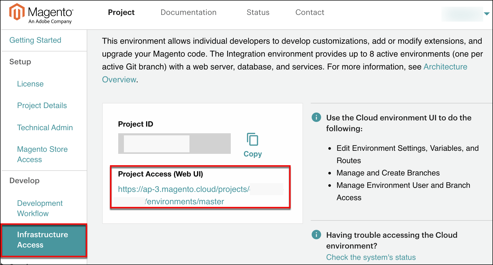

# [!DNL Onboarding] 상거래

Adobe이 클라우드 인프라 구독에서 상거래를 활성화하면 라이선스 소유자(계정 소유자)로 지정된 사람만 초기 프로젝트 및 코드 액세스를 사용할 수 있습니다.

라이선스 소유자는 Adobe Commerce on cloud infrastructure 계정에 대한 결제 및 기타 비즈니스 관련 거래를 관리하는 비즈니스 또는 금융 조직의 사용자입니다. 이 사람은 Adobe과의 연락 창구 역할을 합니다. 계정에서 라이선스 소유자를 변경해야 하는 경우 Adobe 계정 팀에 문의해야 합니다.

라이브 배포를 위한 사이트 개발을 시작할 수 있도록 프로젝트를 빠르게 온보딩하려면 필요한 설정 및 [!DNL onboarding] 작업. 일반적으로 라이선스 소유자는 관리자 액세스 권한을 확보하고 설정, 사용자 지정 및 개발 작업에 도움이 되는 기술 관리자 사용자를 만들어 프로세스를 시작합니다.

## 클라우드 계정에 등록

클라우드 인프라 계정에 Adobe Commerce이 없는 경우 다음으로 문의하십시오. [판매]. 등록하면 Adobe이 계정을 만들고 프로젝트 인터페이스에 액세스하는 방법에 대한 지침을 제공하는 시작 이메일을 보냅니다. 이메일에는 계정에 로그인하여 초기 프로젝트 설정을 완료할 수 있는 링크가 포함되어 있습니다.

### 클라우드 [!DNL Onboarding] UI

의 Adobe Commerce 클라우드 인프라 프로젝트 페이지[!DNL Onboarding] UI)는 프로젝트 및 서비스를 설정하고, 액세스를 결정하고, 개발을 시작하기 위한 시작 체크리스트를 제공합니다. OBUI에서 다음을 수행할 수 있습니다.

- 프로젝트 및 분기를 관리할 수 있는 슈퍼 사용자인 기술 관리자 추가
- 에 대한 링크를 포함하여 프로젝트 환경에 액세스합니다. [!DNL Cloud Console]
- 추가 테스트에 대한 링크를 포함하여 UAT(빠른 사용자 승인 테스트) 체크리스트를 완료합니다

**프로젝트 페이지를 열려면**:

1. 에 로그인 [Adobe Commerce 고객 계정](https://account.magento.com/customer/account/login).

1. 다음에서 _내 계정_ 페이지를 클릭하고 **[!UICONTROL Commerce]** 탭에서 계정의 프로젝트를 볼 수 있습니다.

1. 클릭 **프로젝트 페이지 보기** 다음에서 [프로젝트 섹션](https://cloud.magento.com/cloud/project/).

1. 프로젝트 이름을 클릭하고 클라우드 프로젝트 페이지([!DNL Onboarding] UI).

   

   포털을 탐색하여 프로젝트 계획, 코드 개발 및 UAT 및 사이트 시작 준비를 시작하는 데 도움이 되는 정보 및 옵션을 선택하십시오.

## 프로젝트 액세스 및 사용자 추가

라이선스 소유자는 사용자 계정을 추가하여 코드에 대한 액세스를 제공하고, 분기를 관리하며, 티켓을 입력하고, 환경을 지원할 수 있습니다. 이러한 사용자 계정에는 사내 개발, 컨설턴트 및 솔루션 전문가가 포함될 수 있습니다.

일반적으로 라이선스 소유자는 다음 사용자만 만들 수 있습니다. _기술 관리자_. 기술 관리자는 개발자를 위한 사용자 계정을 만들고, 환경 권한을 설정하고, 모든 분기 및 환경을 관리하기 위해 관리자 액세스 권한이 있는 사용자 계정이 필요합니다. 기술 관리자는 개발자, 컨설턴트 및 [Adobe 솔루션 파트너](https://business.adobe.com/products/magento/partners.html)또는 본인

에서 프로젝트 포털을 통해 기술 관리자를 만들 수 있습니다. [!DNL Cloud Console]또는 를 사용하는 명령줄에서 `magento-cloud` CLI.

### 사용자 등록

클라우드 인프라 프로젝트 및 환경에서 Adobe Commerce에 등록된 사용자만 추가할 수 있습니다. 새 사용자가 있는 경우 다음과 같이 요청하십시오. [계정 등록](https://account.magento.com/customer/account/login/) 계정 프로필과 연결된 이메일 주소를 제공합니다.

### 공유 계정 액세스

라이선스 소유자는 계정에 대한 공유 액세스를 설정할 수 있습니다. 공유 액세스를 통해 신뢰할 수 있는 직원과 서비스 공급자는 도움말 센터를 사용하여 클라우드 인프라 프로젝트에서 Adobe Commerce과 관련된 지원 티켓을 제출하고 추적할 수 있습니다. 설치 지침은 다음을 참조하십시오. [공유 액세스] 도움말 센터에 있는 문서

### [!DNL Cloud Console]

다음을 사용할 수 있습니다. [[!DNL Cloud Console]](cloud-console.md) 프로젝트를 관리하려면 사용자 계정을 추가하고 스토어 개발을 시작하십시오. 라이선스 소유자, 기술 관리자 사용자 및 개발자는 [!DNL Cloud Console] 모든 환경 및 분기, 환경 변수, 환경 설정 및 경로를 관리합니다.

**에 액세스하려면[!DNL Cloud Console]**:

1. 에 로그인 [내 계정](https://account.magento.com/customer/account/login).

1. 다음에서 _내 계정_ 페이지를 클릭하고 **[!UICONTROL Commerce]** 탭에서 계정의 프로젝트를 볼 수 있습니다.

1. 다음을 클릭합니다. **프로젝트** 을(를) 탭하고 프로젝트를 선택합니다.

1. 클릭 **인프라 액세스**&#x200B;을 클릭한 다음 을 클릭합니다 **프로젝트 액세스(웹 UI)**.

   

## Adobe 상태에 등록

에서 클라우드 인프라 플랫폼 환경 및 관련 서비스의 Adobe Commerce에 대한 업데이트를 가져옵니다. [상태 페이지].

이 페이지에서는 Adobe Commerce 구성 요소 및 서비스에 대한 상태 다음에 사고 보고서, 서비스 업그레이드, 계획된 중단 및 예정된 유지 관리에 대한 알림을 제공합니다. 프로젝트에서 작업 중인 모든 사용자는 Adobe Commerce 상태 사이트에 가입하여 이메일 또는 Slack을 통해 이벤트 알림 및 업데이트를 받을 수 있습니다. 지역 및 이벤트별로 특정 제품을 추적하도록 Adobe 상태 구독을 사용자 지정할 수 있습니다.

>[!TIP]
>
> 새 항목 열기 [!DNL Cloud Console] 프로젝트 및 환경 활동을 볼 수 있습니다.
>
>**다음 단계**: [Cl[!DNL ]oud 콘솔에 로그인합니다](cloud-console.md)

<!-- link definitions -->

[판매]: https://business.adobe.com/products/magento/get-demo.html
[공유 액세스]: https://experienceleague.adobe.com/docs/commerce-knowledge-base/kb/help-center-guide/magento-help-center-user-guide.html#shared-access
[상태 페이지]: https://status.adobe.com/products/503473
